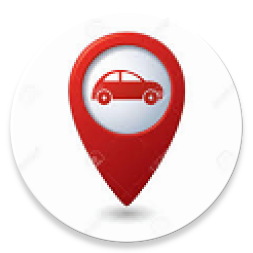

##  World Car 

### Work of ai-world-car-team-c4 ###
Global team approach to solving Self-Driving Car (SDC) challenges. Prize money donated to UNICEF.

### Android studio ###
* the app is created with Android Studio 2.1.3, Java 7 and gradle version 2.2.2
* the minimum Android SDK version is 21 (because my 7" tablet is at that version). If you like to change the minimum version, change the gradle file app/build.gradle 'minSdkVersion' to the version you like. Keep in mind that you may need to fix version related issues.  

### Android studio ###
* obtain an API key from Mapbox
* create a file 'gradle.properties' at root directory.
* add line 'theMapboxApiKeyProp=you-mapbox-api-key'. The Mapbox API key is very long, mine start with 'pk.'.
* add 'gradle.properties' to your .gitignore, so your API key will not be checked in into the repository.

### Network environment ###
* if you run tablet and ubuntu/Autoware box in an enterprise network, I think the app will run. I run the system at home and I had to configure the network.     

### Run the app ###
* when app starts, the car is at your current location. If you compare the screenshots of this check-in to the ones * from last check-in, you will find the car is at a different location because I had moved - still unpacking.
to set destination, long click the location on the map. A route will shown.
* click the fab button (the big red button), the car will move. I modified Mapbox simulator code. In the real world, we should get location from the car GPS (not coded yet). The drawing should be similar.
* when the car reaches the destination, you can set another destination. (the code is pieced together with Mapbox sample code, it is not robust.)
* the video below shows how the app works.      

### TODOs: ###
1. add notification when the car reach the destination
2. let user to type in destination address.   

#### Autoware the Big Challenges ####
1. The car icon moves according to car GPS. Questions:
   a) Is it possible to set destination to car? if yes (guess yes), how?
   b) How can we test the code? The Autoware simulator bag I have is at Japan, I am not familiar with that area to set up a route. My computer cannot digest 3 hours bag.

### Video ###

(https://drive.google.com/file/d/0B6G_lW9c9NY2UzVNblpQd0pVUG8/view?usp=sharing)
